# Ingest OCI logs into Dynatrace
With the OCI Log ingest function, OCI users can stream their logs directly into Dynatrace for troubleshooting and root cause analysis using Davis® AI.  
This OCI function was created to work alongside the Oracle Cloud Infrastructure extension found on the Dynatrace Hub.

### Getting Started
**Note:** These actions must be done by a OCI tenancy administrator using the Oracle Cloud Shell or Oracle Code Editor.

**OCI logs**    
1. Login to the OCI portal and search for **Log Groups**
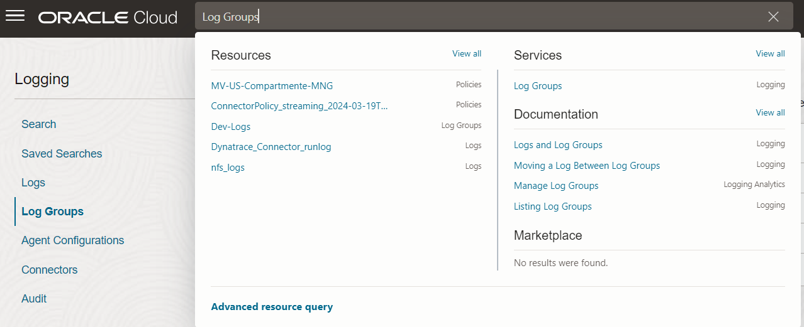
1. Select your compartment on the left side and click **Create Log Group** - A side panel will open.
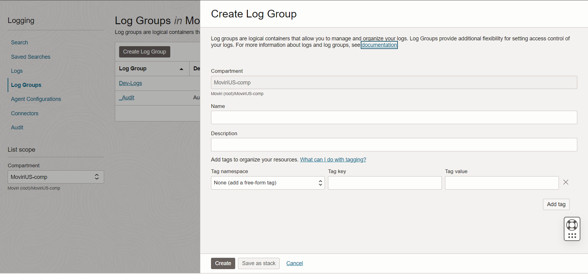
2. Enter your desired name, description and any tags.
3. Click Create to create your new Log Group.
4. In the search bar, search for and select **Logs**.
5. Select either **Create custom log** or **Enable service log**. Enter a name and select the log group you just created.
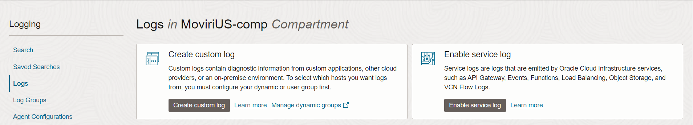
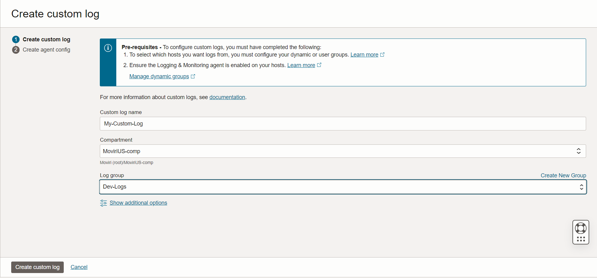
6. Click **Create custom log** or **Enable log** to begin sending logs to your log group.

**OCI function**
1. In the OCI portal, navigate to Applications.
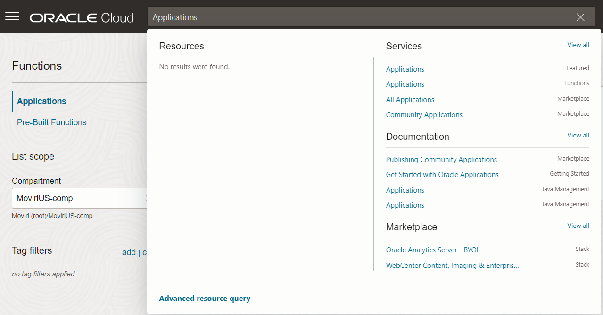
2. Select an existing application or click **Create Application** and give it a name.
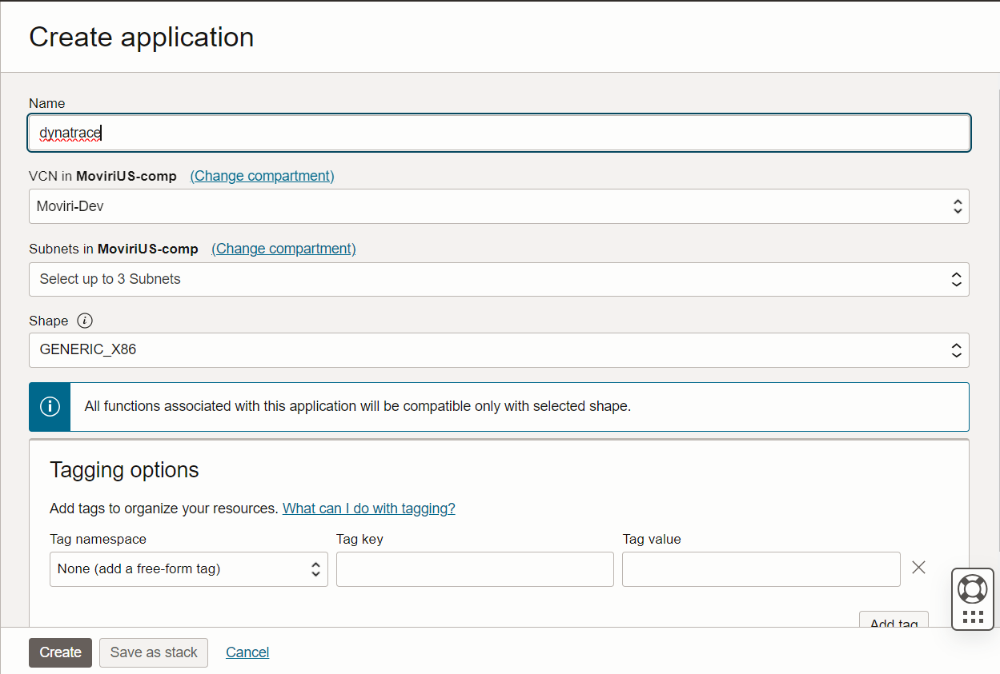
3. Create a new OCI function within your application and give it a name. 
4. We recommend using the Oracle Code Editor to create your custom function. 
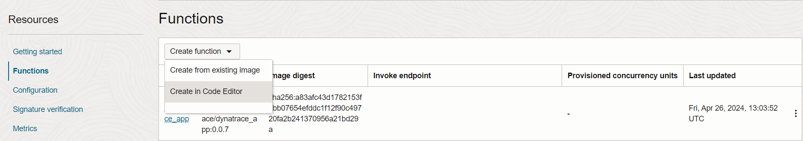
5. Once the Code Editor is open, select **Create from code repository** and enter a function name and the url to the [Github repository](https://github.com/Moviri/oci-log-ingestion). 
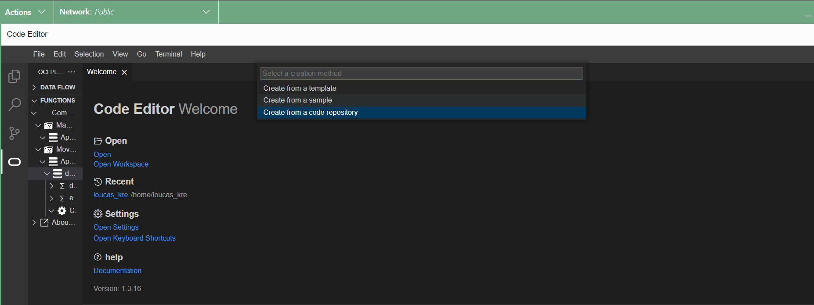
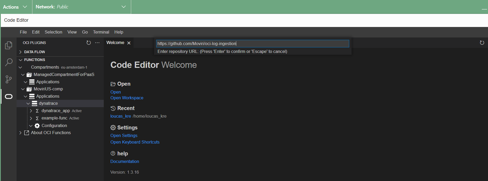

6. Edit the `func.yaml` file, updating the `DYNATRACE_TENANT` and `DYNATRACE_API_KEY` environment variables with the url to your Dynatrace tenant and an api token with the `logs.ingest` scope.
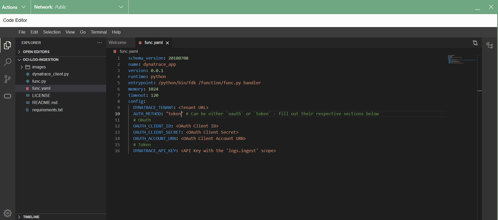
7. Follow the instructions on the **Getting started** page under your application. Use the cloned repository instead of the example function in the instructions. This can be done in the code editor's terminal instead of a separate cloud shell.
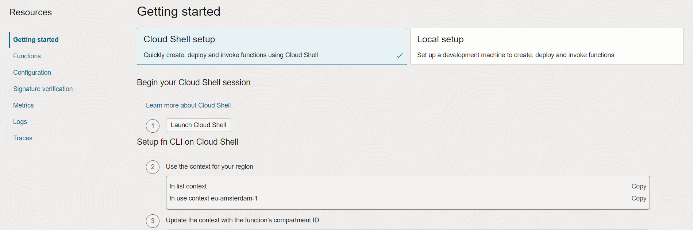 
8. After completeing the commands in the **Getting started** tab, you should see your image under the **Container registry** page.
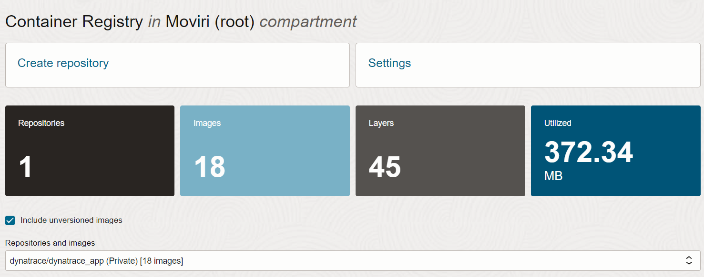

**OCI connector**
1. In the OCI portal, search for **Connectors**
2. Click **Create Connector**, give it a name and description.
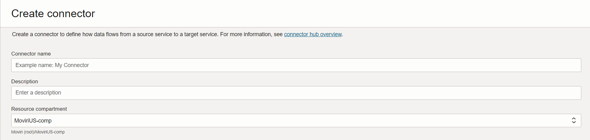
3. Select **Logging** as the source and **Functions** as the target.
4. Under *Configure source* choose the log group and specific log that you want to stream to Dynatrace.
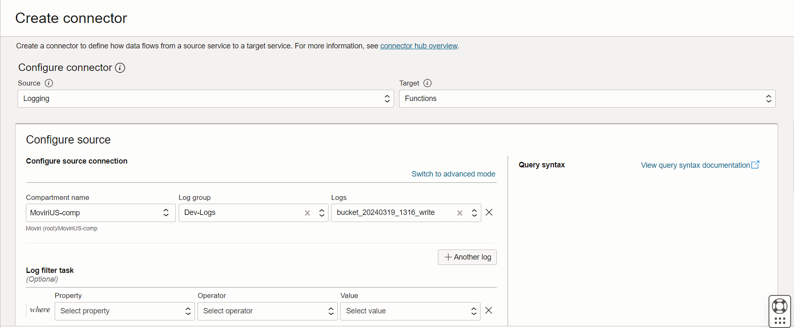
5. Under **Configure target** select your application and function created in the previous steps.
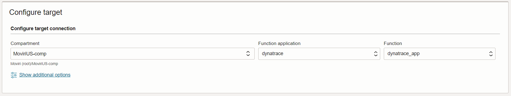
6. If you are prompted to create any policies, click on **Create**.
7. Finally click **Create** at the bottom of the panel, now you have a connector for streaming logs into Dynatrace. 
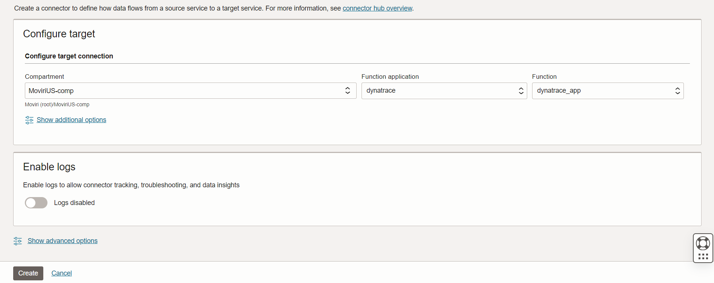

### View and analyze OCI logs 
In the Dynatrace menu, go to **Logs and Events**, to look for OCI logs by filtering by `cloud.provider: oci`.