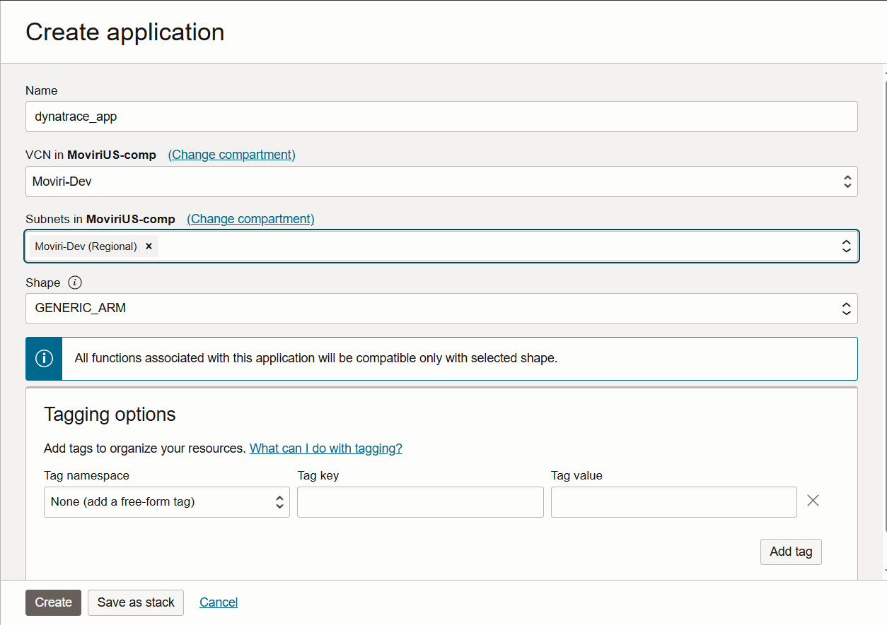

## Purpose
See https://www.dynatrace.com/hub/detail/oracle-connector-hub-signals-ingest/

## Ingest OCI logs into Dynatrace
With the OCI Log ingest function, OCI users can stream their logs directly into Dynatrace for troubleshooting and root cause analysis using Davis® AI.  
This OCI function was created to work alongside the Oracle Cloud Infrastructure extension found on the Dynatrace Hub.

# Getting Started
**Note:** These actions must be done by a OCI tenancy administrator using the Oracle Cloud Shell or Oracle Code Editor.
Policies must also be configured in the OCI tenant to allow the Service Connector read metrics from the tenant. Users should do this using a group where the resource type is `serviceconnectors` before assigning the following policy: 
`Allow group <GROUP_NAME> to read metrics in tenancy`

## OCI logs    
1. Login to the OCI portal and search for **Log Groups**

1. Select your compartment on the left side and click **Create Log Group** - A side panel will open.

2. Enter your desired name, description and any tags.
3. Click Create to create your new Log Group.
4. In the search bar, search for and select **Logs**.
5. Select either **Create custom log** or **Enable service log**. Enter a name and select the log group you just created.

6. Click **Create custom log** or **Enable log** to begin sending logs to your log group.

## OCI function
1. In the OCI portal, navigate to Applications.

2. Select an existing application or click **Create Application** and give it a name, subnet and change the **Shape** to *GENERIC_ARM* then click on 'Create'

3. Create a new OCI function within your application and give it a name. 
4. We recommend using the Oracle Code Editor to create your custom function. 

5. Once the Code Editor is open, select **Create from code repository** and enter a function name and the url to the [Github repository](https://github.com/Moviri/oci-log-ingestion). 

6. Edit the `func.yaml` file, updating the `DYNATRACE_TENANT` and variable with your Dynatrace tenant's URL. If you're using new Dynatrace then the you may need to replace 'apps' with 'live' in the tenant URL.  
Ex: `https://<tenant id>.apps.dynatrace.com` should be `https://<tenant id>.live.dyntrace.com`
    - If you're using token based authentication, set the  value of  `DYNATRACE_API_KEY` to an API token that has the `logs.ingest` scope.
    - If you're using an OAuth2 Client for authentication change the `AUTH_METHOD` to `oauth` and enter your client_id, client_secret and URN. Please see the "Configuring an OAuth2 Client" section for more details on the requirements.

7. Follow the instructions on the **Getting started** page under your application. Use the cloned repository instead of the example function in the instructions. This can be done in the code editor's terminal instead of a separate cloud shell.
 
8. After completeing the commands in the **Getting started** tab, you should see your image under the **Container registry** page.

## OCI connector
1. In the OCI portal, search for **Connectors**
2. Click **Create Connector**, give it a name and description.

3. Select **Logging** as the source and **Functions** as the target.
4. Under *Configure source* choose the log group and specific log that you want to stream to Dynatrace.

5. Under **Configure target** select your application and function created in the previous steps.

6. If you are prompted to create any policies, click on **Create**.

7. Finally click **Create** at the bottom of the panel, now you have a connector for streaming logs into Dynatrace. 

## Configuring an OAuth2 Client
Using an OAuth2 client for the OCI functions will require you to add some additional policies to give the oauth token access to ingest metrics.

1. Visit your Dynatrace tenant's **Account Management** portal and navigate to **Identity & access management** -> **Policy Management**. Click on the add policy button.

2. Give the policy a name like **Metric Ingest** and paste the following policy statement into the large text box `ALLOW storage:metrics:write;` and click on **Save**

3. Now navigate to the **Service Users** page under **Identity & access management** and click on **Add service user**

4. Give the user a name and optionally a description then click on **Save**

5. Click on the 3 vertical dots on the right side of the page and select **View Service User**

6. Copy the **Service user email** that is displayed on this page, you will need it for step 9.
7. Click on the **+Permission** button and from the dropdown menu select the policy we created in step 2.

8. Under **Identity & access management** navigate to **OAuth clients** and click on **Create Client**

9. Paste the service user email address that you copied in setp 6 in the **Subject user email** text box then assign the user **Write metrics** (`storage:metrics:write`) permission.

10. Finally click on **Create Client** at the bottom of the page and copy the `client_id`, `client_secret` and `urn` for use with the OCI function.  

## Debugging 
If you are running into issues getting the connector to work, go to the application and enable **Function Invocation Logs**.

Any errors will be logged here as well as some information about when the function has been run.

## View and analyze OCI logs 
In the Dynatrace menu, go to **Logs and Events**, to look for OCI logs by filtering by `cloud.provider: oci`.
